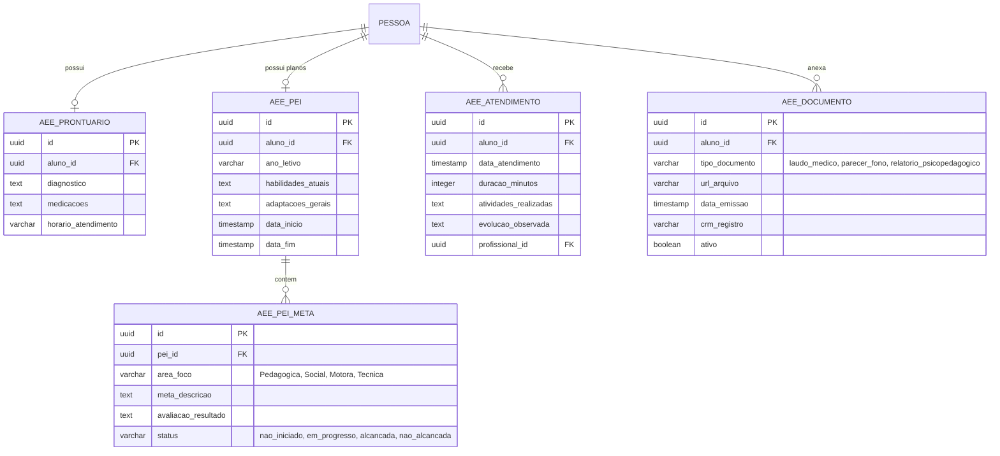

# Proposta de Evolução: Módulo de AEE (Atendimento Educacional Especializado)
### Análise e Sugestões para o Sistema Escolar CSM (Todos os Níveis de Ensino)

Este documento apresenta uma análise detalhada e sugestões para a expansão da sessão de **AEE (Atendimento Educacional Especializado)** do Colégio Stella Maris, visando atender de forma robusta e personalizada os alunos com necessidades especiais em todos os níveis de ensino (Educação Infantil, Ensino Fundamental I e II, Ensino Médio e Ensino Técnico).

---

## 1. Diagnóstico do Modelo Atual

No banco de dados do CSM, o AEE está estruturado na tabela `aee_prontuario` associada à pessoa (aluno) com os seguintes campos básicos:
*   Diagnóstico e medicações.
*   Aspectos positivos e dificuldades.
*   Adaptações de atividades e relatórios.
*   Horário de atendimento (padrão único: "Segunda a Sexta, das 7:30h às 12:00h").
*   Feedback de reuniões.

### Limitações do Modelo Atual:
1.  **Falta de Histórico Temporizado**: O prontuário é um registro único e estático. Não permite acompanhar a evolução do aluno ano a ano ou bimestre a bimestre.
2.  **Falta de Registro de Atendimentos**: Não há como registrar cada sessão individual de atendimento na sala de recursos multifuncionais.
3.  **Falta de Gestão de Laudos**: O campo de diagnóstico é texto simples, não permitindo armazenar cópias dos laudos médicos ou pareceres de terapeutas externos.
4.  **Uniformidade Excessiva**: O modelo não se adapta às diferentes realidades pedagógicas dos níveis de ensino (ex: necessidades do Ensino Infantil vs. Ensino Técnico).

---

## 2. Proposta de Expansão Funcional por Nível de Ensino

O AEE deve ser flexível para lidar com as metas e dinâmicas de cada etapa escolar:

### 2.1. Educação Infantil (Foco em Desenvolvimento e Estimulação)
*   **Foco Principal**: Desenvolvimento motor, de linguagem, socialização e estimulação sensorial precoce.
*   **Recursos Necessários no Sistema**:
    *   Mapeamento de marcos de desenvolvimento infantil (baseado nos campos de experiência da BNCC).
    *   Relatórios descritivos frequentes de observação comportamental e integração social.
    *   Ficha de rotina e cuidados específicos de higiene/alimentação.

### 2.2. Ensino Fundamental I e II (Foco em Adaptação e Aprendizado)
*   **Foco Principal**: Processo de alfabetização, letramento, raciocínio lógico e adaptação de materiais didáticos.
*   **Recursos Necessários no Sistema**:
    *   **PEI (Plano de Desenvolvimento Individualizado)**: Planejamento pedagógico com metas bimestrais/trimestrais customizadas.
    *   Flexibilização do tempo de avaliação e tipos de provas (Conceitual, Oral, Simplificada).
    *   Integração direta com o diário do professor regente para compartilhamento de estratégias de sala de aula.

### 2.3. Ensino Médio (Foco em Autonomia e Vestibular/ENEM)
*   **Foco Principal**: Gestão de conteúdos complexos e abstratos, preparação para o mercado/universidade e autonomia pessoal.
*   **Recursos Necessários no Sistema**:
    *   Plano de acessibilidade em exames de larga escala (solicitação de ledor, transcritor, tempo adicional ou prova em braille).
    *   Suporte a recursos avançados de tecnologia assistiva (leitores de tela, softwares de comunicação alternativa).

### 2.4. Ensino Técnico e Profissionalizante (Foco em Acessibilidade Laboral e Estágios)
*   **Foco Principal**: Adaptação de práticas laboratoriais, ferramentas de desenvolvimento de software/máquinas e preparação para inserção no mercado de trabalho.
*   **Recursos Necessários no Sistema**:
    *   **Plano de Acessibilidade Laboral**: Adaptações necessárias para a realização de aulas práticas em laboratórios de informática, redes ou eletrônica.
    *   **Parecer de Viabilidade de Estágio**: Mapeamento de condições de acessibilidade em empresas parceiras que ofertam vagas de estágio supervisionado.
    *   Uso de IDEs e ferramentas tecnológicas adaptadas (ex: ferramentas com suporte a comandos de voz, alto contraste ou acessíveis a leitores de tela).

---

## 3. Arquitetura de Dados Sugerida (Drizzle/PostgreSQL)

Para comportar essa estrutura, sugerimos a divisão do módulo em 4 tabelas fundamentais:



### Código de Schema Proposto (Drizzle SQLX):

```typescript
// Enum de status de meta do PEI
export const statusMetaEnum = pgEnum('status_meta_pei', ['nao_iniciado', 'em_progresso', 'alcancada', 'nao_alcancada']);
// Enum de áreas do PEI
export const areaMetaEnum = pgEnum('area_meta_pei', ['pedagogica', 'social', 'motora', 'tecnica', 'autonomia']);

// Plano de Desenvolvimento Individualizado
export const aeePei = pgTable('aee_pei', {
  id: uuid('id').defaultRandom().primaryKey(),
  alunoId: uuid('aluno_id').references(() => pessoa.id, { onDelete: 'cascade' }).notNull(),
  anoLetivoId: uuid('ano_letivo_id').notNull(),
  objetivosGerais: text('objetivos_gerais'),
  recursosNecessarios: text('recursos_necessarios'),
  adaptacoesLaboratorio: text('adaptacoes_laboratorio'), // Especifico para Ensino Tecnico
  dataInicio: timestamp('data_inicio').notNull(),
  dataFim: timestamp('data_fim').notNull(),
  createdAt: timestamp('created_at').defaultNow().notNull(),
  updatedAt: timestamp('updated_at').defaultNow().notNull(),
});

// Metas do PEI
export const aeePeiMeta = pgTable('aee_pei_meta', {
  id: uuid('id').defaultRandom().primaryKey(),
  peiId: uuid('pei_id').references(() => aeePei.id, { onDelete: 'cascade' }).notNull(),
  area: areaMetaEnum('area').notNull(),
  descricaoMeta: text('descricao_meta').notNull(),
  estrategiasPedagogicas: text('estrategias_pedagogicas'),
  status: statusMetaEnum('status').default('nao_iniciado').notNull(),
  parecerFinal: text('parecer_final'),
});

// Histórico de Atendimentos Individuais
export const aeeAtendimento = pgTable('aee_atendimento', {
  id: uuid('id').defaultRandom().primaryKey(),
  alunoId: uuid('aluno_id').references(() => pessoa.id, { onDelete: 'cascade' }).notNull(),
  profissionalId: uuid('profissional_id').references(() => pessoa.id).notNull(), // Professor AEE
  dataAtendimento: timestamp('data_atendimento').defaultNow().notNull(),
  duracaoMinutos: integer('duracao_minutos').default(50).notNull(),
  registroSessao: text('registro_sessao').notNull(),
  recursosUtilizados: text('recursos_utilizados'),
});

// Documentos e Pareceres Clínicos
export const aeeDocumento = pgTable('aee_documento', {
  id: uuid('id').defaultRandom().primaryKey(),
  alunoId: uuid('aluno_id').references(() => pessoa.id, { onDelete: 'cascade' }).notNull(),
  tipoDocumento: varchar('tipo_documento', { length: 100 }).notNull(), // ex: 'laudo_medico', 'parecer_psicologico'
  profissionalEmissor: varchar('profissional_emissor', { length: 255 }).notNull(),
  registroProfissional: varchar('registro_profissional', { length: 50 }), // CRM, CRP, CREFITO
  urlArquivo: varchar('url_arquivo', { length: 500 }).notNull(),
  dataEmissao: timestamp('data_emissao'),
  createdAt: timestamp('created_at').defaultNow().notNull(),
});
```

---

## 4. Segurança e Conformidade (LGPD)

Laudos médicos, diagnósticos clínicos e planos psicopedagógicos são classificados pela **LGPD** como **dados sensíveis** (Artigo 5º, II). Portanto, a segurança desse módulo deve ser máxima:

1.  **RLS (Row Level Security) Restrito**:
    *   **Alunos/Responsáveis**: Não devem ter acesso irrestrito aos relatórios internos de fonoaudiologia/psicologia clínica gerados pela escola, apenas ao PEI consolidado e orientações de atividades de apoio familiar.
    *   **Professores Comuns (Regentes)**: Acesso restrito apenas às estratégias de adaptação de aula e metas pedagógicas (PEI). Não devem ter acesso a laudos clínicos detalhados de saúde.
    *   **Profissionais do AEE/Coordenação**: Acesso total de leitura e escrita.
2.  **Auditoria Estrita**:
    *   Toda consulta e modificação de documentos AEE deve gerar um registro inalterável na tabela de `audit_log`, registrando quem visualizou o laudo e quando.
