# SDD — Sistema de Gestão Escolar · Colégio Santa Mônica

> **Documento**: Software Design Document (SDD)
> **Versão**: 0.1.0-draft
> **Data**: 2026-06-02
> **Metodologia**: SDD + TDD + POO + DDD (Domain-Driven Design)
> **Status**: 🟡 Aguardando Aprovação

---

## 1. Visão Geral

### 1.1 Problema

O Colégio Santa Mônica utiliza atualmente o sistema **Sponte** para gestão escolar. O objetivo é construir um **sistema proprietário** que substitua o Sponte de forma gradual, começando em operação paralela e migrando progressivamente até a independência total.

### 1.2 Escopo do Sistema

Um sistema de controles internos que abrange:

| Módulo | Fase | Prioridade |
|--------|------|------------|
| **Cadastros** (Pessoas) | MVP (Fase 1) | 🔴 Crítica |
| **Pedagógico** (Turmas, Notas, Diários) | MVP (Fase 1) | 🔴 Crítica |
| **Secretaria** (Documentos, Histórico, Contratos) | MVP (Fase 1) | 🔴 Crítica |
| **Financeiro** (Contas, Cobranças) | Fase 2 | 🟡 Alta |
| **Biblioteca** (Acervo, Empréstimos) | Fase 3 | 🟢 Média |
| **RH** (Folha, Pagamento de Professores) | Fase 3 | 🟢 Média |
| **Portal do Responsável** | Fase 4 | 🔵 Futura |

### 1.3 Requisitos Não-Funcionais

| Requisito | Especificação |
|-----------|---------------|
| **Escala** | 1.000+ alunos ativos, crescimento contínuo |
| **Retenção de dados** | Permanente — NUNCA excluir automaticamente. Alarme de acúmulo + exportação manual |
| **Usuários simultâneos** | Até 20 (equipe administrativa), expansível |
| **Níveis de Ensino** | Ed. Infantil, Fund. I, Fund. II, Técnico |
| **Regime letivo** | Misto (anual para regular, modular para técnicos) |
| **Alta coesão, baixo acoplamento** | Requisito explícito do cliente |

### 1.4 Integrações Previstas

| Integração | Fase | Observação |
|------------|------|------------|
| Gateway de pagamento (boleto/PIX) | Fase 2 | A definir provedor |
| Controle de catraca / acesso físico | Fase 3 | Protocolo a definir |
| Portal do Responsável (web) | Fase 4 | Previsão arquitetural desde o MVP |
| Geração de documentos oficiais | Fase 1 | Declarações, histórico, boletim |

---

## 2. Decisões Arquiteturais

### 2.1 Stack Tecnológica Recomendada

> [!IMPORTANT]
> **Recomendação para o cenário descrito**: considerando 1.000+ alunos, retenção de 5+ anos, equipe técnica enxuta e necessidade de evolução gradual, a stack recomendada é:

```
┌─────────────────────────────────────────────────────────┐
│                    FRONTEND                              │
│  Next.js 15 (App Router) + TypeScript                   │
│  UI: Shadcn/ui + Tailwind CSS                           │
│  State: Zustand · Data Fetching: TanStack Query         │
├─────────────────────────────────────────────────────────┤
│                    BACKEND                                │
│  Next.js API Routes (Server Actions)                     │
│  Validação: Zod                                          │
│  ORM: Drizzle ORM (type-safe, SQL-first)                │
├─────────────────────────────────────────────────────────┤
│                    BANCO DE DADOS                        │
│  Supabase (PostgreSQL 15+ gerenciado)                   │
│  Auth: Supabase Auth (JWT + RLS)                         │
│  Storage: Supabase Storage (documentos/anexos)           │
│  Realtime: Supabase Realtime (notificações)              │
├─────────────────────────────────────────────────────────┤
│                    INFRAESTRUTURA                        │
│  Deploy: Vercel (frontend) + Supabase Cloud (backend)   │
│  Monitoramento: Vercel Analytics + Sentry               │
│  CI/CD: GitHub Actions                                   │
└─────────────────────────────────────────────────────────┘
```

#### Justificativa da Stack

| Decisão | Razão |
|---------|-------|
| **Supabase** (não PostgreSQL puro) | Auth, Storage, Realtime, RLS e dashboard admin built-in. Reduz complexidade operacional para equipe pequena. Migração para PostgreSQL puro possível a qualquer momento (Supabase = PostgreSQL padrão) |
| **Drizzle ORM** (não Prisma) | SQL-first, mais performático, type-safe, migrations versionadas. Melhor para queries complexas de relatórios |
| **Vercel + Supabase Cloud** | Custo previsível, zero ops, escalabilidade automática. Para 20 usuários + 1000 alunos: plano Pro ($25/mês cada) é mais que suficiente |
| **Shadcn/ui** | Componentes acessíveis, customizáveis e próprios (não dependência de pacote) |
| **Next.js com Server Actions** | Consistência com o projeto "Atendimento Comercial" existente, facilitando futura integração |

> [!TIP]
> **Custo estimado de infraestrutura**: veja a seção **2.4** para análise detalhada com 3 cenários em R$ (de R$ 257 a R$ 861/mês).

### 2.2 Estratégia de Migração Futura (Absorção do Atendimento Comercial)

A arquitetura será desenhada com **interfaces (contratos)** entre módulos, permitindo que o sistema "Atendimento Comercial" existente seja integrado como um módulo futuro sem reescrever o core:

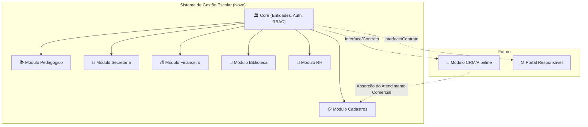

### 2.3 Hospedagem — Recomendação

> [!IMPORTANT]
> **Recomendação: Vercel + Supabase Cloud (Managed)**

| Critério | Vercel + Supabase | VPS Própria | AWS/GCP |
|----------|-------------------|-------------|---------|
| Custo inicial | ~$50-75/mês | ~$30-50/mês | ~$100+/mês |
| Complexidade operacional | ✅ Mínima | ❌ Alta | ❌ Muito alta |
| Escalabilidade | ✅ Automática | ❌ Manual | ✅ Automática |
| Backup automático | ✅ Sim | ❌ Configurar | ✅ Configurar |
| SSL/HTTPS | ✅ Automático | ❌ Configurar | ❌ Configurar |
| Ideal para equipe de | 1-3 devs | 2+ devs ops | 3+ devs ops |

Para uma escola com equipe técnica enxuta, a combinação **Vercel + Supabase** elimina a necessidade de administrar servidores, certificados SSL, backups e monitoramento de infraestrutura.

### 2.4 Estimativa de Custo REAL e Completa (em R$)

> [!IMPORTANT]
> **Referência do cliente**: Sponte custa atualmente **R$ 700/mês** com até 5 acessos simultâneos e todas as funcionalidades. A demanda simultânea é baixa — lançamento e consulta de notas são pontuais.
>
> **Base de cálculo**: Cotação USD/BRL de 02/06/2026 = R$ 5,03 (mercado). Com spread bancário + IOF (6,38%) = taxa efetiva de **~R$ 5,65 por USD**.

---

#### 2.4.1 Análise dos Planos Free — O que é viável e o que NÃO é

| Serviço | Plano Free | Limites | Atende 1000 alunos + 5 usuários? | Risco |
|---------|-----------|---------|--------------------------------|-------|
| **Supabase** | Free | 500 MB banco, 1 GB storage, 50k MAUs, 2 projetos, RLS ✅ | ⚠️ Parcialmente | 🔴 **Auto-pause após 7 dias sem queries** — sistema fica offline |
| **Vercel** | Hobby | 100 GB bandwidth, 1M function calls, SSL automático | ✅ Sim — tráfego de 5 usuários é mínimo | 🔴 **Uso comercial proibido** nos termos de serviço |
| **GitHub** | Free | Repos privados ∞, 2000 min/mês Actions, 500 MB storage | ✅ Totalmente | 🟢 Nenhum |
| **Sentry** | Developer | 5.000 eventos erro/mês, 1 usuário | ✅ Totalmente | 🟢 Nenhum |
| **Resend** | Free | 100 emails/dia, 3.000/mês | ✅ Totalmente | 🟢 Nenhum |

##### Estimativa de uso do banco (500 MB do Supabase Free)

```
┌──────────────────────────────────────────────────────────────┐
│ CÁLCULO: 1.000 alunos cabem em 500 MB?                       │
├──────────────────────────────────────────────────────────────┤
│                                                               │
│ Tabela                    │ Registros │ ~Tamanho estimado     │
│ ──────────────────────────┼───────────┼────────────────────── │
│ pessoas                   │   3.000   │  ~3 MB                │
│ dados_aluno               │   1.000   │  ~0,5 MB              │
│ dados_funcionario         │     100   │  ~0,1 MB              │
│ dados_responsavel         │   1.500   │  ~0,5 MB              │
│ documentos                │   3.000   │  ~1,5 MB              │
│ enderecos                 │   3.500   │  ~1,5 MB              │
│ contatos                  │   5.000   │  ~1,5 MB              │
│ turmas (5 anos)           │     250   │  ~0,1 MB              │
│ matriculas (5 anos)       │   5.000   │  ~2 MB                │
│ notas (5 anos)            │  80.000   │  ~15 MB               │
│ frequencia (5 anos)       │ 500.000   │  ~50 MB               │
│ diario_classe (5 anos)    │  25.000   │  ~8 MB                │
│ contratos                 │   2.000   │  ~1 MB                │
│ índices + overhead        │     —     │  ~30 MB               │
│ ──────────────────────────┼───────────┼────────────────────── │
│ TOTAL ESTIMADO            │           │  ~115 MB              │
│                                                               │
│ 💡 VEREDICTO: 115 MB de ~500 MB = 23% de uso                │
│    → Os DADOS cabem no Free por ~3-4 anos                    │
│    → Mas anexos/PDFs (Storage 1 GB) encherão antes           │
│                                                               │
└──────────────────────────────────────────────────────────────┘
```

##### Problemas críticos do 100% Free

| Problema | Impacto | Solução |
|----------|---------|---------|
| 🔴 **Supabase auto-pause** (7 dias sem query) | Sistema fica offline, cold start de ~30s para retornar | Cron job via GitHub Actions que faz 1 query a cada 5 dias (contorno funcional, mas frágil) |
| 🔴 **Vercel Hobby = uso pessoal** | Viola termos de serviço para uso comercial/institucional | Migrar para Vercel Pro ($20/mês) ou Cloudflare Pages (free sem restrição comercial) |
| 🟡 **Sem backup automático** (Supabase Free) | Perda de dados em caso de falha ou erro humano | Criar script de backup manual via `pg_dump` semanal + salvar em Google Drive |
| 🟡 **Storage limitado** (1 GB) | Anexos de documentos (contratos, certidões) estouram rápido | Usar storage externo gratuito (Google Drive API, ou manter em Cloudflare R2 free: 10 GB) |

---

#### 2.4.2 Cenários de Custo Mensal de Infraestrutura

```
┌──────────────────────────────────────────────────────────────────────────────┐
│              CENÁRIOS DE CUSTO MENSAL DE INFRAESTRUTURA (R$)                 │
├──────────────────────────────────────────────────────────────────────────────┤
│                                                                              │
│  ⚪ CENÁRIO ZERO: 100% FREE (máximo risco)                                  │
│  ┌──────────────────────────────────────────────────────────────┐            │
│  │ Supabase Free ........................... R$    0,00         │            │
│  │ Vercel Hobby ............................ R$    0,00         │            │
│  │ GitHub Free ............................. R$    0,00         │            │
│  │ Sentry Free ............................. R$    0,00         │            │
│  │ Resend Free ............................. R$    0,00         │            │
│  │ Domínio .com.br ......................... R$    3,33         │            │
│  │──────────────────────────────────────────────────────────────│            │
│  │ TOTAL MENSAL ............................ R$    3,33         │            │
│  └──────────────────────────────────────────────────────────────┘            │
│  ⚠️ NÃO RECOMENDADO para produção:                                         │
│  → Auto-pause pode derrubar o sistema em período de férias                  │
│  → Viola termos do Vercel (uso comercial)                                   │
│  → Sem backup automático (risco de perda de dados)                          │
│  → Útil APENAS para desenvolvimento e testes                                │
│                                                                              │
│  ─ ─ ─ ─ ─ ─ ─ ─ ─ ─ ─ ─ ─ ─ ─ ─ ─ ─ ─ ─ ─ ─ ─ ─ ─ ─ ─ ─              │
│                                                                              │
│  🟢 CENÁRIO RECOMENDADO: HÍBRIDO INTELIGENTE (seguro + barato)              │
│  ┌──────────────────────────────────────────────────────────────┐            │
│  │ Supabase Pro ............................ R$  141,25         │            │
│  │   → Sem auto-pause ✅                                       │            │
│  │   → Backup diário automático (7 dias) ✅                    │            │
│  │   → 8 GB banco + 100 GB storage ✅                          │            │
│  │ Vercel Hobby ............................ R$    0,00         │            │
│  │   → ⚠️ Veja nota sobre uso comercial abaixo                │            │
│  │ GitHub Free ............................. R$    0,00         │            │
│  │ Sentry Free ............................. R$    0,00         │            │
│  │ Resend Free ............................. R$    0,00         │            │
│  │ Domínio .com.br ......................... R$    3,33         │            │
│  │──────────────────────────────────────────────────────────────│            │
│  │ TOTAL MENSAL ............................ R$  144,58         │            │
│  │ TOTAL ANUAL ............................. R$ 1.734,96        │            │
│  └──────────────────────────────────────────────────────────────┘            │
│  ✅ O único serviço pago é o Supabase Pro ($25/mês)                         │
│  ✅ Elimina TODOS os riscos críticos do free:                               │
│     - Sem auto-pause (sistema 24/7)                                         │
│     - Backup automático diário                                              │
│     - 8 GB de banco (suficiente para 5+ anos)                               │
│     - 100 GB de storage (documentos e anexos)                               │
│     - RLS + Auth + Realtime inclusos                                        │
│  ✅ Segurança igual ao Pro em todos os outros serviços                      │
│                                                                              │
│  ─ ─ ─ ─ ─ ─ ─ ─ ─ ─ ─ ─ ─ ─ ─ ─ ─ ─ ─ ─ ─ ─ ─ ─ ─ ─ ─ ─              │
│                                                                              │
│  🟡 CENÁRIO COMPLETO: TUDO PAGO (zero riscos)                               │
│  ┌──────────────────────────────────────────────────────────────┐            │
│  │ Supabase Pro ............................ R$  141,25         │            │
│  │ Vercel Pro (1 seat) ..................... R$  113,00         │            │
│  │ GitHub Free ............................. R$    0,00         │            │
│  │ Sentry Free ............................. R$    0,00         │            │
│  │ Resend Free ............................. R$    0,00         │            │
│  │ Domínio .com.br ......................... R$    3,33         │            │
│  │──────────────────────────────────────────────────────────────│            │
│  │ TOTAL MENSAL ............................ R$  257,58         │            │
│  │ TOTAL ANUAL ............................. R$ 3.090,96        │            │
│  └──────────────────────────────────────────────────────────────┘            │
│  → Licenciamento comercial regularizado no Vercel                            │
│  → Ideal se o sistema crescer para portal externo (fase futura)              │
│                                                                              │
└──────────────────────────────────────────────────────────────────────────────┘
```

> [!TIP]
> **Sobre o Vercel Hobby para uso institucional**: O plano Hobby do Vercel é tecnicamente restrito a uso pessoal/não-comercial. No entanto, para um sistema **interno** de uma escola sem fins lucrativos (apenas 5 usuários administrativos, sem receita gerada pelo sistema), o risco de enforcement é extremamente baixo. Se preferir total conformidade, uma alternativa é usar **Cloudflare Pages** (free para uso comercial, 100k requests/dia, sem restrição) como deploy do frontend — mesma funcionalidade, zero custo, zero risco legal.

---

#### 2.4.3 Comparativo Direto: Sponte R$ 700/mês vs Sistema Próprio

```
┌──────────────────────────────────────────────────────────────────────────────┐
│                    COMPARATIVO: SPONTE vs SISTEMA PRÓPRIO                     │
├──────────────────────────────────────────────────────────────────────────────┤
│                                                                              │
│                         SPONTE              SISTEMA PRÓPRIO                  │
│                         ──────              ───────────────                  │
│ Custo mensal            R$ 700/mês          R$ 144,58/mês (híbrido)         │
│ Custo anual             R$ 8.400/ano        R$ 1.734,96/ano                 │
│                                                                              │
│ ┌────────────────────────────────────────────────────────────┐               │
│ │          ECONOMIA ANUAL: R$ 6.665,04/ano                   │               │
│ │          ECONOMIA MENSAL: R$ 555,42/mês                    │               │
│ │          ECONOMIA EM 3 ANOS: R$ 19.995,12                  │               │
│ └────────────────────────────────────────────────────────────┘               │
│                                                                              │
│ Acessos simultâneos     5 (limitado)        20+ (sem limite hard)           │
│ Funcionalidades         Todas (prontas)     Construídas sob medida          │
│ Customização            Nenhuma             Total                            │
│ Dados                   Servidor Sponte     100% da escola                  │
│ Segurança (RLS)         Sponte decide       Você configura                  │
│ Backup                  Sponte faz          Supabase Pro: diário (7 dias)   │
│ Disponibilidade         Depende do Sponte   99.9% (Supabase + Vercel SLA)  │
│ Suporte técnico         Incluso             Equipe interna                  │
│ Migração de dados       Difícil (lock-in)   PostgreSQL padrão (portável)    │
│                                                                              │
└──────────────────────────────────────────────────────────────────────────────┘
```

---

#### 2.4.4 Custo TOTAL Real: Infraestrutura + Desenvolvimento

> [!CAUTION]
> **A seção abaixo é a mais importante para a decisão.** O custo de infraestrutura (R$ 144/mês) é pequeno. O investimento real é o **desenvolvimento do sistema**. Sem essa conta, qualquer análise é incompleta.

##### Estimativa de horas de desenvolvimento (MVP — Fase 1)

| Módulo / Atividade | Horas estimadas | Observação |
|--------------------|----------------|-----------|
| Setup do projeto (repo, CI/CD, auth, layout, design system) | 40-60h | Fundação do sistema inteiro |
| **Cadastros** — CRUD de Pessoas + classificações + abas | 60-80h | Formulários complexos, validações, filtros |
| **Pedagógico** — Turmas, Matrículas, Disciplinas | 40-60h | Relacionamentos complexos |
| **Pedagógico** — Notas, Avaliações, Frequência | 50-70h | Cálculos, regras de negócio |
| **Secretaria** — Contratos, Documentos, Histórico | 40-60h | Geração de PDF |
| **RBAC** — Permissões, RLS, testes de segurança | 20-30h | Crítico para multi-usuário |
| **Testes** (TDD: unit + integration + e2e) | 40-60h | ~30% do tempo de dev |
| **Polimento** — UX, responsividade, bugs, deploy | 20-30h | Inevitável |
| **TOTAL MVP** | **310-450 horas** | |

##### Três caminhos de desenvolvimento com custos

```
┌──────────────────────────────────────────────────────────────────────────────┐
│              CUSTO DE DESENVOLVIMENTO — 3 CAMINHOS                           │
├──────────────────────────────────────────────────────────────────────────────┤
│                                                                              │
│  🤖 CAMINHO 1: DESENVOLVIMENTO COM IA (você + ferramentas de IA)            │
│  ┌──────────────────────────────────────────────────────────────┐            │
│  │ Horas necessárias: ~200-300h (IA acelera ~40%)              │            │
│  │ Custo de ferramentas de IA: R$ 0 - 150/mês                 │            │
│  │ Custo de desenvolvimento: R$ 0 (seu tempo)                  │            │
│  │ Prazo estimado: 3-6 meses (dedicação parcial)               │            │
│  │──────────────────────────────────────────────────────────────│            │
│  │ INVESTIMENTO TOTAL MVP: R$ 0 - 900 (ferramentas)            │            │
│  │ + INFRA: R$ 144,58/mês × 6 meses = R$ 867,48              │            │
│  │ TOTAL: R$ 867 - 1.767                                       │            │
│  └──────────────────────────────────────────────────────────────┘            │
│  ✅ Menor custo possível                                                    │
│  ✅ Você conhece 100% do código                                             │
│  ⚠️ Depende do seu nível técnico e disponibilidade                         │
│  ⚠️ Prazo mais longo                                                       │
│                                                                              │
│  ─ ─ ─ ─ ─ ─ ─ ─ ─ ─ ─ ─ ─ ─ ─ ─ ─ ─ ─ ─ ─ ─ ─ ─ ─ ─ ─ ─              │
│                                                                              │
│  👨‍💻 CAMINHO 2: FREELANCER PLENO/SÊNIOR                                    │
│  ┌──────────────────────────────────────────────────────────────┐            │
│  │ Horas necessárias: ~350h (média da estimativa)              │            │
│  │ Valor hora (pleno): R$ 80 - 120/h                           │            │
│  │ Valor hora (sênior): R$ 120 - 200/h                         │            │
│  │ Prazo estimado: 2-4 meses (dedicação integral)              │            │
│  │──────────────────────────────────────────────────────────────│            │
│  │ INVESTIMENTO PLENO:  350h × R$ 100 = R$ 35.000             │            │
│  │ INVESTIMENTO SÊNIOR: 350h × R$ 150 = R$ 52.500             │            │
│  │ + INFRA: R$ 144,58/mês × 4 meses = R$ 578,32              │            │
│  │ TOTAL: R$ 15.000 - 53.000                                   │            │
│  └──────────────────────────────────────────────────────────────┘            │
│  ✅ Entrega mais rápida e profissional                                      │
│  ✅ Código com qualidade garantida                                          │
│  ⚠️ Custo significativo upfront                                            │
│  ⚠️ Dependência do freelancer para manutenção futura                       │
│                                                                              │
│  ─ ─ ─ ─ ─ ─ ─ ─ ─ ─ ─ ─ ─ ─ ─ ─ ─ ─ ─ ─ ─ ─ ─ ─ ─ ─ ─ ─              │
│                                                                              │
│  🤖+👨‍💻 CAMINHO 3: HÍBRIDO (você com IA + revisão profissional)             │
│  ┌──────────────────────────────────────────────────────────────┐            │
│  │ Você desenvolve ~70% com ajuda de IA                        │            │
│  │ Freelancer revisa arquitetura + código crítico (~80h)       │            │
│  │ Freelancer pleno: 80h × R$ 100 = R$ 8.000                  │            │
│  │ Prazo estimado: 3-5 meses                                   │            │
│  │──────────────────────────────────────────────────────────────│            │
│  │ INVESTIMENTO: R$ 8.000 - 12.000                             │            │
│  │ + INFRA: R$ 144,58/mês × 5 meses = R$ 722,90              │            │
│  │ TOTAL: R$ 8.700 - 12.700                                    │            │
│  └──────────────────────────────────────────────────────────────┘            │
│  ✅ Equilíbrio entre custo e qualidade                                      │
│  ✅ Você aprende e mantém o sistema                                         │
│  ✅ Código crítico revisado por profissional                                │
│                                                                              │
└──────────────────────────────────────────────────────────────────────────────┘
```

---

#### 2.4.5 Análise de ROI: Quando o sistema se paga?

```
┌──────────────────────────────────────────────────────────────────────────────┐
│                    TEMPO PARA RETORNO DO INVESTIMENTO                         │
├──────────────────────────────────────────────────────────────────────────────┤
│                                                                              │
│  Economia mensal vs Sponte: R$ 700 - R$ 144,58 = R$ 555,42/mês             │
│                                                                              │
│  Caminho           │ Investimento │ Break-even     │ Economia 3 anos        │
│  ──────────────────┼──────────────┼────────────────┼─────────────────────── │
│  🤖 Você + IA      │ R$ 1.500     │ ~3 meses       │ R$ 18.500+             │
│  🤖+👨‍💻 Híbrido     │ R$ 10.000    │ ~18 meses      │ R$ 10.000+             │
│  👨‍💻 Freelancer     │ R$ 35.000    │ ~63 meses*     │ -R$ 15.000 (3 anos)   │
│                                                                              │
│  * Com freelancer sênior (R$ 52.500), o break-even ultrapassa 5 anos.       │
│    Só compensa se a escola tem volume que justifique (2000+ alunos)         │
│    ou se a customização gera economia em outros setores.                    │
│                                                                              │
│  ┌──────────────────────────────────────────────────────────────┐            │
│  │ 💡 CONCLUSÃO: Para R$ 700/mês do Sponte com 5 acessos,      │            │
│  │    o melhor ROI é o Caminho 1 (você + IA) ou Caminho 3       │            │
│  │    (híbrido). Contratar um freelancer dedicado só se paga    │            │
│  │    se houver ganhos além da economia de mensalidade.         │            │
│  └──────────────────────────────────────────────────────────────┘            │
│                                                                              │
└──────────────────────────────────────────────────────────────────────────────┘
```

---

#### 2.4.6 TCO (Custo Total de Propriedade) — 3 Anos

| Item | Sponte (3 anos) | Sistema Próprio — Caminho 1 | Sistema Próprio — Caminho 3 |
|------|----------------|---------------------------|---------------------------|
| Mensalidade / Infraestrutura | R$ 25.200 | R$ 5.205 | R$ 5.205 |
| Desenvolvimento (investimento único) | R$ 0 | R$ 1.500 | R$ 10.000 |
| Manutenção mensal estimada (10h/mês) | R$ 0 | R$ 0 (você faz) | R$ 0 (você faz) |
| **TOTAL 3 ANOS** | **R$ 25.200** | **R$ 6.705** | **R$ 15.205** |
| **Economia acumulada** | — | **R$ 18.495** | **R$ 9.995** |

---

#### 2.4.7 Veredicto e Recomendação Final

> [!IMPORTANT]
> **Recomendação para a sua situação específica:**
>
> | Fator | Avaliação |
> |-------|-----------|
> | Sponte custa R$ 700/mês | ✅ Margem de economia significativa |
> | Demanda simultânea é baixa (5 usuários) | ✅ Free tiers atendem perfeitamente a performance |
> | 1.000 alunos | ✅ Cabe no Supabase Pro (8 GB) por 5+ anos |
> | Dados cabem em 500 MB (Free) | ✅ Mas sem backup = risco inaceitável para escola |
>
> **Stack de custo recomendada para produção:**
>
> | Serviço | Plano | Custo R$/mês | Por que este plano? |
> |---------|-------|-------------|-------------------|
> | **Supabase** | **Pro** | R$ 141,25 | ⚡ Único serviço pago. Elimina auto-pause, garante backup diário, 8 GB |
> | Vercel ou Cloudflare Pages | Free | R$ 0,00 | 5 usuários = fração mínima do free tier |
> | GitHub | Free | R$ 0,00 | Repos privados + CI/CD suficiente |
> | Sentry | Free | R$ 0,00 | 5.000 erros/mês = mais que suficiente |
> | Resend | Free | R$ 0,00 | 3.000 emails/mês = sobra |
> | Domínio .com.br | Registro.br | R$ 3,33 | Anual (~R$ 40/ano) |
> | **TOTAL** | | **R$ 144,58/mês** | **79% mais barato que Sponte** |
>
> 📊 **Economia: R$ 555,42/mês = R$ 6.665/ano**

> [!TIP]
> **Próximo passo prático**: Use o **Cenário ZERO (100% free)** durante todo o desenvolvimento e testes — custo zero. Migre o Supabase para **Pro ($25/mês)** apenas no dia em que o sistema entrar em produção real com dados verdadeiros. Assim, o investimento inicial é literalmente R$ 0 em infraestrutura.

---

## 3. Modelagem de Domínio (DDD + POO)

### 3.1 Bounded Contexts

Seguindo DDD (Domain-Driven Design), o sistema é dividido em **contextos delimitados** independentes:

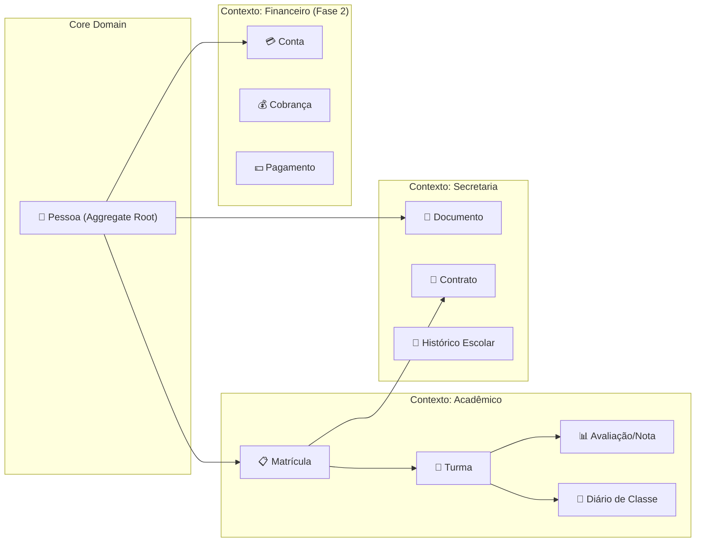

### 3.2 Entidade Central: Pessoa (Aggregate Root)

A entidade `Pessoa` é o **núcleo do sistema**. Uma mesma pessoa pode ter múltiplas classificações simultaneamente (ex: um funcionário que também é responsável de um aluno).

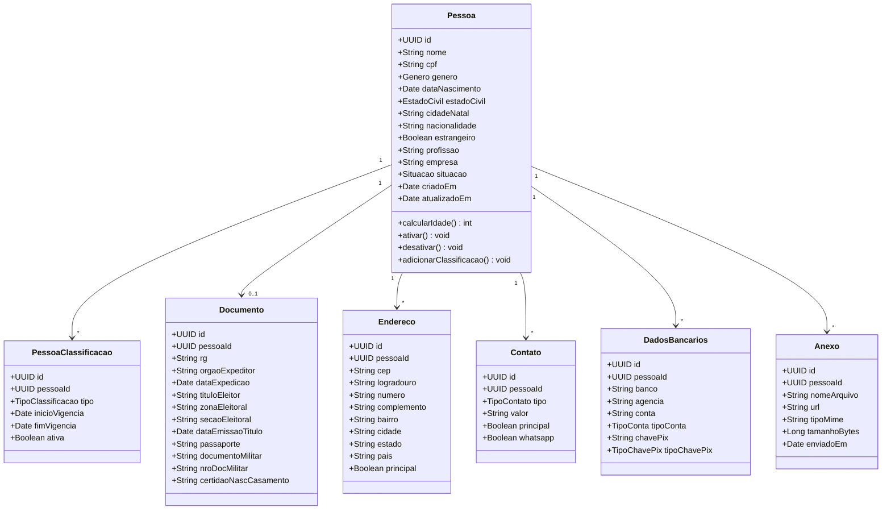

### 3.3 Classificações de Pessoa

| Classificação | Descrição | Campos Adicionais |
|---------------|-----------|-------------------|
| **Aluno** | Estudante matriculado | Nº Matrícula, RA, Cód. Barras, Login/Senha Portal, Turma Atual, Cartão Catraca |
| **Funcionário** | Colaborador da escola | Cargo, Departamento, Data Admissão, Salário, Carga Horária |
| **Responsável** | Responsável legal de aluno(s) | Grau Parentesco, Autorizado para retirada |
| **Interessado** (Lead) | Pessoa que demonstrou interesse | Canal de Origem, Status do Follow-up |

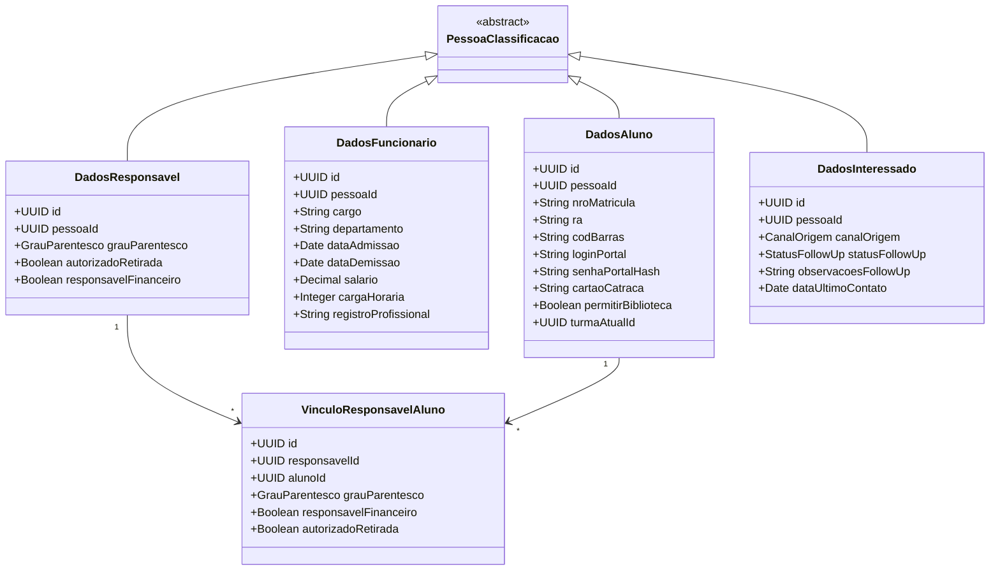

### 3.4 Contexto Acadêmico / Pedagógico

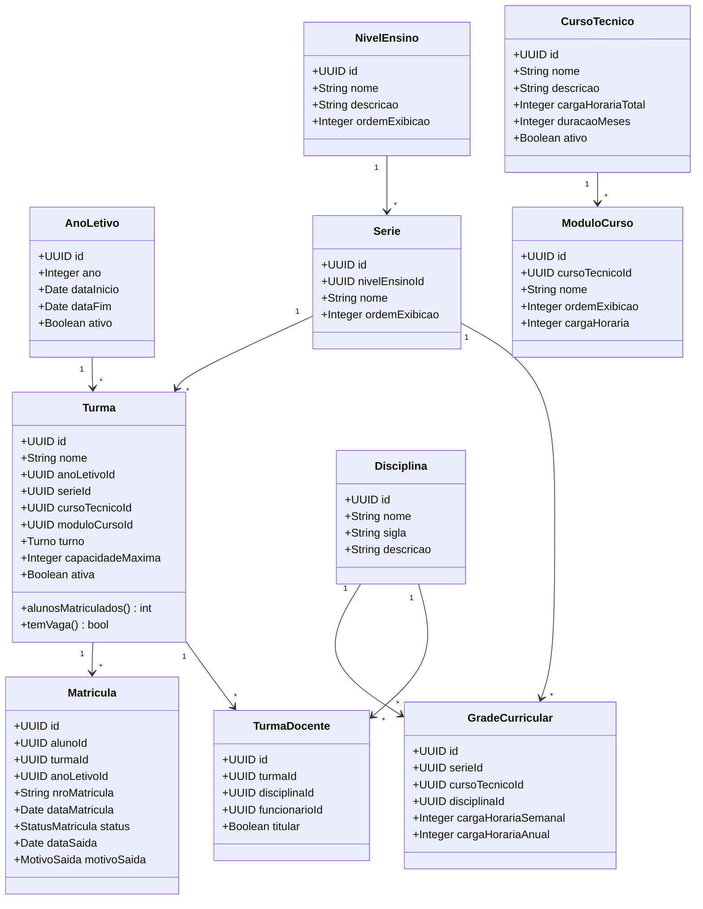

### 3.5 Avaliações e Notas

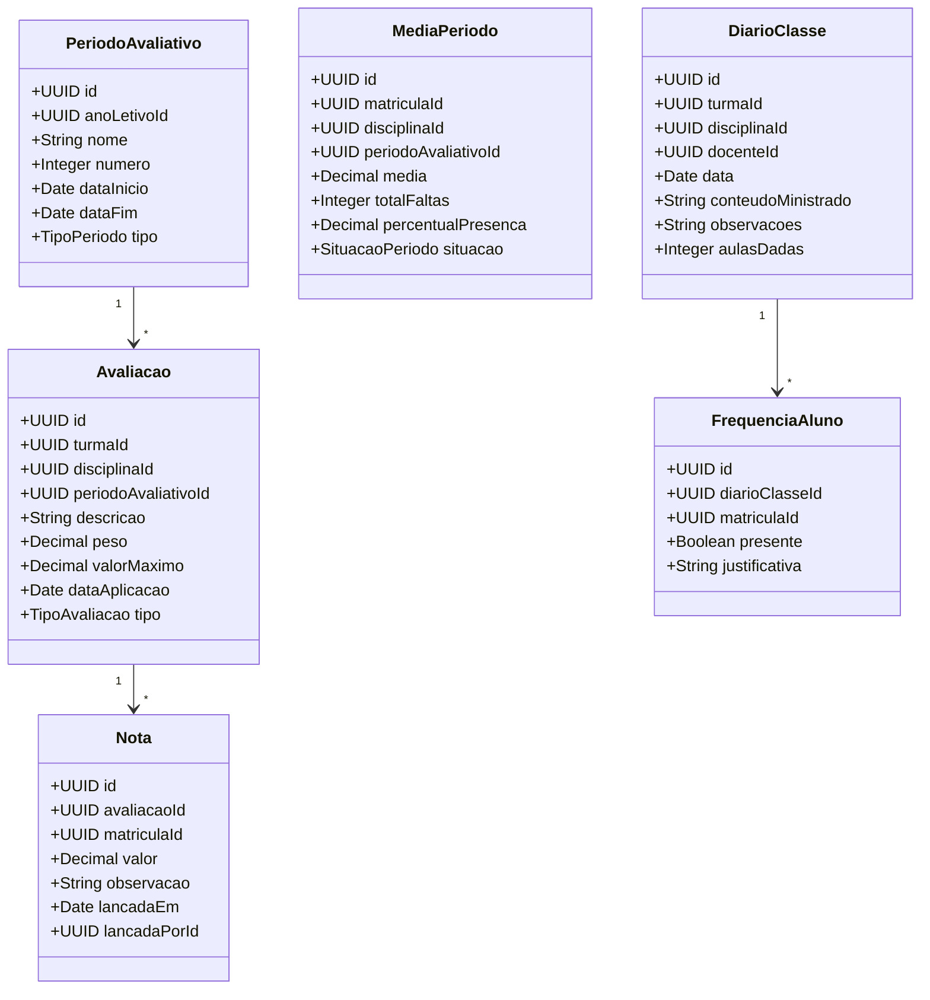

### 3.6 Contexto Secretaria

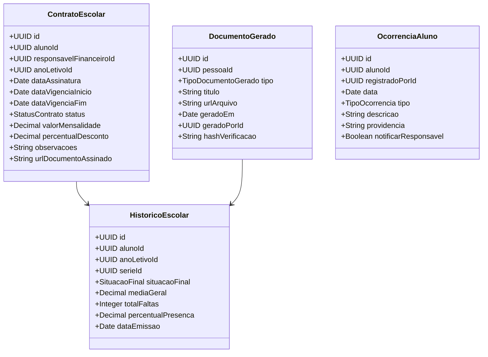

### 3.7 Regras de Negócio: Pedagógico, Avaliação e Frequência

```text
┌──────────────────────────────────────────────────────────────────────────┐
│             REGRAS PEDAGÓGICAS E DE AVALIAÇÃO                           │
├──────────────────────────────────────────────────────────────────────────┤
│                                                                          │
│  1. FORMA DE AVALIAÇÃO POR NÍVEL DE ENSINO                              │
│  ─────────────────────────────────────────────────────                   │
│  → Ensino Fundamental e Técnico: Avaliação Numérica (0 a 10)            │
│  → Educação Infantil: Avaliação Conceitual                              │
│    - Focada no desenvolvimento de habilidades e comportamentos           │
│    - Sem notas numéricas, baseada em rubricas/pareceres                 │
│                                                                          │
│  2. CÁLCULO DE MÉDIA (Fundamental e Técnico)                            │
│  ─────────────────────────────────────────────────────                   │
│  → Fórmula: Média Aritmética Simples                                    │
│  → Arredondamento: Sempre arredondar para o 0,5 posterior mais próximo  │
│    - Ex: 6.1 a 6.4 → 6.5                                                │
│    - Ex: 6.6 a 6.9 → 7.0                                                │
│  → Recuperação:                                                         │
│    - Cálculo: (Média Antes da Rec. + Nota da Rec.) / 2                  │
│    - Regras de corte diferem entre Educação Básica e Técnico            │
│                                                                          │
│  3. REGRA DE FREQUÊNCIA PARA APROVAÇÃO                                  │
│  ─────────────────────────────────────────────────────                   │
│  → Exigência mínima: 75% de presença no período/ano letivo              │
│                                                                          │
│  4. ESTRUTURA DOS CURSOS TÉCNICOS (Ex: Enfermagem)                      │
│  ─────────────────────────────────────────────────────                   │
│  → Grade curricular independente do ensino regular                      │
│  → Suporte para cadastro de disciplinas com carga horária específica    │
│  → Suporte para disciplinas de Estágio Prático (com ou sem nota)        │
│                                                                          │
└──────────────────────────────────────────────────────────────────────────┘
```

---

## 4. Schema do Banco de Dados (PostgreSQL)

### 4.1 Enums (Tipos Enumerados)

```sql
-- Enums Globais
CREATE TYPE situacao_pessoa AS ENUM ('ativo', 'inativo', 'suspenso', 'transferido', 'formado', 'desistente');
CREATE TYPE genero AS ENUM ('masculino', 'feminino', 'outro', 'nao_informado');
CREATE TYPE estado_civil AS ENUM ('solteiro', 'casado', 'divorciado', 'viuvo', 'uniao_estavel', 'separado');
CREATE TYPE tipo_classificacao AS ENUM ('aluno', 'funcionario', 'responsavel', 'interessado', 'fornecedor');
CREATE TYPE tipo_contato AS ENUM ('celular', 'telefone_fixo', 'email', 'whatsapp');
CREATE TYPE tipo_conta_bancaria AS ENUM ('corrente', 'poupanca', 'salario');
CREATE TYPE tipo_chave_pix AS ENUM ('cpf', 'cnpj', 'email', 'celular', 'aleatoria');

-- Enums Acadêmicos
CREATE TYPE turno AS ENUM ('matutino', 'vespertino', 'noturno', 'integral');
CREATE TYPE status_matricula AS ENUM ('ativa', 'trancada', 'cancelada', 'concluida', 'transferida');
CREATE TYPE motivo_saida AS ENUM ('transferencia', 'desistencia', 'conclusao', 'expulsao', 'outro');
CREATE TYPE tipo_periodo AS ENUM ('bimestre', 'trimestre', 'semestre', 'modulo');
CREATE TYPE tipo_avaliacao AS ENUM ('prova', 'trabalho', 'seminario', 'recuperacao', 'participacao', 'outro');
CREATE TYPE situacao_periodo AS ENUM ('aprovado', 'reprovado', 'recuperacao', 'em_andamento');

-- Enums Secretaria
CREATE TYPE status_contrato AS ENUM ('rascunho', 'ativo', 'encerrado', 'cancelado', 'renovado');
CREATE TYPE tipo_documento_gerado AS ENUM ('declaracao_matricula', 'historico_escolar', 'boletim', 'declaracao_transferencia', 'declaracao_conclusao', 'outro');
CREATE TYPE situacao_final AS ENUM ('aprovado', 'reprovado', 'transferido', 'desistente', 'em_curso');
CREATE TYPE tipo_ocorrencia AS ENUM ('disciplinar', 'pedagogica', 'saude', 'elogio', 'comunicado', 'outro');

-- Enums Follow-up (Interessados)
CREATE TYPE canal_origem AS ENUM ('site', 'whatsapp', 'telefone', 'indicacao', 'rede_social', 'presencial', 'outro');
CREATE TYPE status_follow_up AS ENUM ('novo', 'em_contato', 'agendado', 'matriculado', 'perdido', 'desistiu');

-- Enums Parentesco
CREATE TYPE grau_parentesco AS ENUM ('pai', 'mae', 'avo', 'avo_materna', 'tio', 'tia', 'irmao', 'irma', 'padrasto', 'madrasta', 'tutor_legal', 'outro');
```

### 4.2 Tabelas Principais

> [!NOTE]
> Todas as tabelas utilizam `UUID` como chave primária, `created_at` e `updated_at` com triggers automáticos. **Não há exclusão automática de dados** — registros inativos permanecem no banco com flag de situação. Exportação manual disponível para Excel/CSV/JSON.

#### Diagrama Entidade-Relacionamento (Simplificado)

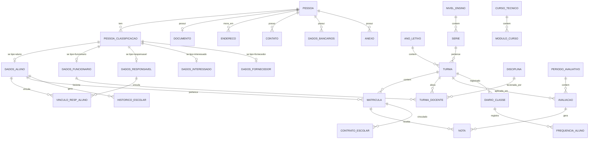

### 4.3 Política de Dados: Retenção Permanente + Alarme + Exportação

> [!CAUTION]
> **REGRA ABSOLUTA: O sistema NUNCA exclui dados automaticamente.**
> Nenhum soft-delete, nenhum hard-delete, nenhum job de arquivamento automático. Todo dado que entra no sistema permanece até que um operador humano decida exportar e remover manualmente.

```
┌──────────────────────────────────────────────────────────────────────────┐
│             POLÍTICA DE DADOS — RETENÇÃO PERMANENTE                     │
├──────────────────────────────────────────────────────────────────────────┤
│                                                                          │
│  1. NENHUMA EXCLUSÃO AUTOMÁTICA                                         │
│  ─────────────────────────────────────────────────────                   │
│  → NÃO existe soft-delete (sem campo deleted_at)                        │
│  → NÃO existe hard-delete automático                                    │
│  → NÃO existe job de arquivamento programado                            │
│  → Registros inativos recebem flag: situacao = 'inativo'               │
│    mas PERMANECEM na mesma tabela, consultáveis normalmente             │
│                                                                          │
│  2. ALARME DE ACÚMULO DE DADOS                                         │
│  ─────────────────────────────────────────────────────                   │
│  → Dashboard exibe uso atual do banco vs limite do plano               │
│  → Alertas automáticos via email/notificação interna:                   │
│    * 50% do limite → Alerta informativo                                │
│    * 75% do limite → Alerta de atenção                                 │
│    * 90% do limite → Alerta crítico + sugestão de exportação           │
│  → Métricas acompanhadas:                                               │
│    - Tamanho total do banco (MB/GB)                                     │
│    - Número de registros por tabela                                     │
│    - Volume de anexos no storage                                        │
│    - Crescimento mensal estimado                                        │
│                                                                          │
│  3. EXPORTAÇÃO SOB DEMANDA (decisão humana)                             │
│  ─────────────────────────────────────────────────────                   │
│  → Formatos disponíveis para exportação:                                │
│    - Excel (.xlsx) — com abas separadas por entidade                   │
│    - CSV (.csv) — compatível com qualquer sistema                      │
│    - JSON (.json) — formato técnico para reimportação                   │
│    - PDF — relatórios formatados para arquivo físico                    │
│  → Filtros de exportação:                                               │
│    - Por período (ano letivo, intervalo de datas)                       │
│    - Por tipo de pessoa (alunos, funcionários, etc.)                    │
│    - Por situação (ativos, inativos, formados, etc.)                   │
│    - Por módulo (notas, frequência, contratos, etc.)                   │
│  → Exportação gera arquivo completo com todos os                       │
│    relacionamentos preservados (pessoa + notas + frequência)            │
│  → Arquivo exportado serve como backup recuperável                     │
│                                                                          │
│  4. REMOÇÃO MANUAL (somente por admin, após exportação)                 │
│  ─────────────────────────────────────────────────────                   │
│  → Disponível APENAS para o papel 'admin'                              │
│  → Fluxo obrigatório:                                                   │
│    1. Admin seleciona registros para remoção                           │
│    2. Sistema EXIGE exportação prévia (não pula esta etapa)            │
│    3. Confirmação dupla ("Tem certeza? Os dados foram exportados?")    │
│    4. Registro de auditoria: quem removeu, quando, quais dados         │
│    5. Dados removidos permanecem no arquivo exportado                   │
│  → Log de auditoria é PERMANENTE e não pode ser removido               │
│                                                                          │
│  5. CICLO DE VIDA DO REGISTRO                                           │
│  ─────────────────────────────────────────────────────                   │
│                                                                          │
│    [Ativo] ──▶ [Inativo (flag)] ──▶ [Exportado + Removido (*)]         │
│       │              │                       │                          │
│    No banco        No banco            No arquivo exportado             │
│    Consultável     Consultável         Excel/CSV/JSON/PDF               │
│    Editável        Somente leitura     Recuperável                      │
│                                        (*) Somente por admin            │
│                                            com exportação prévia        │
│                                                                          │
└──────────────────────────────────────────────────────────────────────────┘
```

#### Estimativa de crescimento do banco (para calibrar alarmes)

| Ano | Registros acumulados estimados | Tamanho estimado | % do Supabase Pro (8 GB) |
|-----|-------------------------------|-----------------|-------------------------|
| Ano 1 | ~100k registros | ~25 MB | 0,3% |
| Ano 3 | ~350k registros | ~70 MB | 0,9% |
| Ano 5 | ~600k registros | ~115 MB | 1,4% |
| Ano 10 | ~1,2M registros | ~230 MB | 2,9% |
| Ano 20 | ~2,5M registros | ~500 MB | 6,3% |

> [!TIP]
> **Conclusão**: Mesmo sem NUNCA excluir dados, o banco não atinge nem 10% da capacidade do Supabase Pro em 20 anos para esse volume de escola. O alarme de acúmulo serve como rede de segurança, não como necessidade imediata. Os anexos (PDFs, documentos digitalizados) são o item que mais cresce — monitorar o storage separadamente.

---

## 5. Arquitetura de Software (POO + Clean Architecture)

### 5.1 Estrutura de Diretórios

```
src/
├── app/                          # Next.js App Router
│   ├── (auth)/                   # Rotas de autenticação
│   │   ├── login/
│   │   └── layout.tsx
│   ├── (dashboard)/              # Layout autenticado
│   │   ├── page.tsx              # Dashboard principal
│   │   ├── cadastros/
│   │   │   ├── alunos/
│   │   │   │   ├── page.tsx      # Listagem com filtros
│   │   │   │   ├── [id]/
│   │   │   │   │   ├── page.tsx  # Detalhe/Edição
│   │   │   │   │   └── tabs/     # Abas: Dados, Endereço, Docs...
│   │   │   │   └── novo/
│   │   │   │       └── page.tsx
│   │   │   ├── funcionarios/
│   │   │   ├── responsaveis/
│   │   │   ├── interessados/
│   │   │   └── layout.tsx
│   │   ├── pedagogico/
│   │   │   ├── turmas/
│   │   │   ├── diarios/
│   │   │   ├── notas/
│   │   │   ├── avaliacoes/
│   │   │   └── layout.tsx
│   │   ├── secretaria/
│   │   │   ├── contratos/
│   │   │   ├── documentos/
│   │   │   ├── historico/
│   │   │   ├── ocorrencias/
│   │   │   └── layout.tsx
│   │   └── layout.tsx
│   └── api/                      # API Routes (quando necessário)
│
├── core/                         # 🏛️ Camada de Domínio (POO puro)
│   ├── entities/                 # Entidades de domínio
│   │   ├── pessoa.ts
│   │   ├── aluno.ts
│   │   ├── funcionario.ts
│   │   ├── responsavel.ts
│   │   ├── interessado.ts
│   │   ├── turma.ts
│   │   ├── matricula.ts
│   │   ├── avaliacao.ts
│   │   └── contrato.ts
│   ├── value-objects/            # Objetos de valor (imutáveis)
│   │   ├── cpf.ts
│   │   ├── email.ts
│   │   ├── telefone.ts
│   │   └── endereco.ts
│   ├── enums/                    # Enumerações de domínio
│   │   ├── situacao.ts
│   │   ├── genero.ts
│   │   └── ...
│   ├── errors/                   # Erros de domínio tipados
│   │   ├── validation-error.ts
│   │   └── business-rule-error.ts
│   └── interfaces/               # Contratos (interfaces/ports)
│       ├── repositories/
│       │   ├── pessoa-repository.ts
│       │   ├── aluno-repository.ts
│       │   ├── turma-repository.ts
│       │   └── ...
│       └── services/
│           ├── auth-service.ts
│           ├── document-generator.ts
│           └── notification-service.ts
│
├── application/                  # 🔄 Camada de Aplicação (Use Cases)
│   ├── use-cases/
│   │   ├── cadastros/
│   │   │   ├── criar-pessoa.ts
│   │   │   ├── atualizar-pessoa.ts
│   │   │   ├── buscar-pessoa.ts
│   │   │   ├── listar-alunos.ts
│   │   │   ├── classificar-pessoa.ts
│   │   │   └── vincular-responsavel.ts
│   │   ├── pedagogico/
│   │   │   ├── criar-turma.ts
│   │   │   ├── matricular-aluno.ts
│   │   │   ├── lancar-nota.ts
│   │   │   ├── registrar-frequencia.ts
│   │   │   └── calcular-media.ts
│   │   └── secretaria/
│   │       ├── gerar-contrato.ts
│   │       ├── gerar-documento.ts
│   │       ├── registrar-ocorrencia.ts
│   │       └── gerar-historico.ts
│   ├── dtos/                     # Data Transfer Objects
│   │   ├── pessoa-dto.ts
│   │   ├── aluno-dto.ts
│   │   └── ...
│   └── validators/               # Schemas de validação (Zod)
│       ├── pessoa-schema.ts
│       ├── matricula-schema.ts
│       └── ...
│
├── infrastructure/               # 🔧 Camada de Infraestrutura
│   ├── database/
│   │   ├── drizzle/
│   │   │   ├── schema/           # Schemas Drizzle (espelham o DB)
│   │   │   │   ├── pessoa.ts
│   │   │   │   ├── academico.ts
│   │   │   │   └── secretaria.ts
│   │   │   ├── migrations/       # Migrations versionadas
│   │   │   └── seed/             # Dados iniciais
│   │   └── repositories/        # Implementações dos repositórios
│   │       ├── supabase-pessoa-repository.ts
│   │       ├── supabase-aluno-repository.ts
│   │       └── ...
│   ├── auth/
│   │   └── supabase-auth-service.ts
│   ├── storage/
│   │   └── supabase-storage-service.ts
│   └── documents/
│       └── pdf-generator.ts      # Geração de PDFs (react-pdf)
│
├── presentation/                 # 🎨 Camada de Apresentação
│   ├── components/
│   │   ├── ui/                   # Componentes base (Shadcn)
│   │   ├── layout/
│   │   │   ├── sidebar.tsx
│   │   │   ├── header.tsx
│   │   │   ├── nav-menu.tsx
│   │   │   └── breadcrumbs.tsx
│   │   ├── cadastros/
│   │   │   ├── pessoa-form.tsx
│   │   │   ├── pessoa-table.tsx
│   │   │   ├── filtros-avancados.tsx
│   │   │   └── tabs/
│   │   │       ├── dados-pessoais-tab.tsx
│   │   │       ├── endereco-tab.tsx
│   │   │       ├── documentos-tab.tsx
│   │   │       ├── responsaveis-tab.tsx
│   │   │       ├── dados-bancarios-tab.tsx
│   │   │       ├── anexos-tab.tsx
│   │   │       └── observacoes-tab.tsx
│   │   ├── pedagogico/
│   │   └── secretaria/
│   ├── hooks/
│   │   ├── use-pessoas.ts
│   │   ├── use-turmas.ts
│   │   └── ...
│   └── stores/                   # Zustand stores
│       ├── auth-store.ts
│       ├── sidebar-store.ts
│       └── filtro-store.ts
│
├── shared/                       # 🔗 Utilitários compartilhados
│   ├── utils/
│   │   ├── formatters.ts         # CPF, telefone, datas
│   │   ├── validators.ts         # Validações comuns
│   │   └── constants.ts
│   ├── types/
│   │   └── index.ts
│   └── config/
│       └── app-config.ts
│
└── tests/                        # 🧪 Testes (TDD)
    ├── unit/
    │   ├── core/
    │   │   ├── entities/
    │   │   │   ├── pessoa.test.ts
    │   │   │   └── ...
    │   │   └── value-objects/
    │   │       ├── cpf.test.ts
    │   │       └── ...
    │   └── application/
    │       ├── criar-pessoa.test.ts
    │       ├── matricular-aluno.test.ts
    │       └── ...
    ├── integration/
    │   ├── repositories/
    │   │   ├── pessoa-repository.test.ts
    │   │   └── ...
    │   └── api/
    │       └── ...
    └── e2e/
        ├── cadastro-aluno.test.ts
        ├── lancamento-notas.test.ts
        └── ...
```

### 5.2 Princípios de Design (SOLID + Clean Architecture)

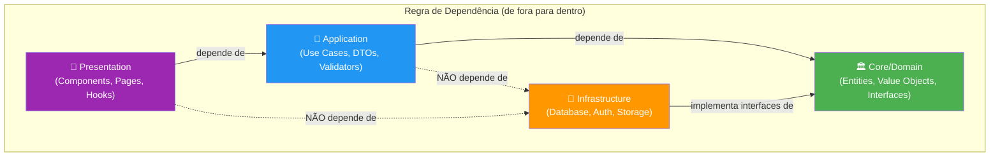

| Princípio | Aplicação no Projeto |
|-----------|---------------------|
| **S** — Single Responsibility | Cada Use Case faz uma coisa. Ex: `CriarPessoa`, `MatricularAluno` |
| **O** — Open/Closed | Novas classificações de pessoa adicionadas sem modificar `Pessoa` |
| **L** — Liskov Substitution | `SupabasePessoaRepository` substituível por `MockPessoaRepository` nos testes |
| **I** — Interface Segregation | `IPessoaRepository` separado de `IAlunoRepository` |
| **D** — Dependency Inversion | Use Cases dependem de interfaces (ports), não de implementações (adapters) |

### 5.3 Padrões de Projeto Utilizados

| Padrão | Onde | Por quê |
|--------|------|---------|
| **Repository** | `infrastructure/database/repositories/` | Abstrair acesso a dados, facilitar testes e troca de ORM |
| **Use Case / Interactor** | `application/use-cases/` | Encapsular regras de negócio em unidades testáveis |
| **Value Object** | `core/value-objects/` | CPF, Email, Telefone — imutáveis, com validação embutida |
| **DTO** | `application/dtos/` | Transferir dados entre camadas sem expor entidades |
| **Factory** | Criação de entidades complexas | Ex: criar `Pessoa` com todas as classificações e documentos |
| **Observer** | Notificações e eventos | Ex: ao matricular aluno, notificar financeiro para gerar contrato |
| **Strategy** | Cálculo de médias | Diferentes estratégias por nível de ensino (nota, conceito, etc.) |
| **Template Method** | Geração de documentos | Base comum para declaração, histórico, boletim |

---

## 6. Sistema de Permissões (RBAC)

### 6.1 Papéis do Sistema

| Papel | Descrição | Módulos de Acesso |
|-------|-----------|-------------------|
| **admin** | Administrador geral | Todos |
| **secretaria** | Funcionário da secretaria | Cadastros, Secretaria, Pedagógico (leitura) |
| **coordenador** | Coordenador pedagógico | Pedagógico, Cadastros (leitura), Secretaria |
| **professor** | Docente | Pedagógico (suas turmas), Cadastros (leitura restrita) |
| **financeiro** | Setor financeiro | Financeiro, Cadastros (leitura) |
| **bibliotecario** | Responsável pela biblioteca | Biblioteca, Cadastros (leitura) |
| **rh** | Recursos humanos | RH, Cadastros (funcionários) |

### 6.2 Matriz de Permissões (MVP — Fase 1)

| Recurso | admin | secretaria | coordenador | professor |
|---------|-------|------------|-------------|-----------|
| **Pessoas: Criar** | ✅ | ✅ | ❌ | ❌ |
| **Pessoas: Editar** | ✅ | ✅ | ⚠️ alunos | ❌ |
| **Pessoas: Listar** | ✅ | ✅ | ✅ | ⚠️ suas turmas |
| **Pessoas: Desativar** | ✅ | ✅ | ❌ | ❌ |
| **Turmas: Gerenciar** | ✅ | ✅ | ✅ | ❌ |
| **Matrículas: Gerenciar** | ✅ | ✅ | ✅ | ❌ |
| **Notas: Lançar** | ✅ | ❌ | ✅ | ✅ próprias |
| **Notas: Visualizar** | ✅ | ✅ | ✅ | ✅ próprias |
| **Diário: Registrar** | ✅ | ❌ | ✅ | ✅ próprias |
| **Frequência: Registrar** | ✅ | ❌ | ✅ | ✅ próprias |
| **Documentos: Gerar** | ✅ | ✅ | ✅ | ❌ |
| **Contratos: Gerenciar** | ✅ | ✅ | ❌ | ❌ |
| **Ocorrências: Registrar** | ✅ | ✅ | ✅ | ✅ |
| **Configurações** | ✅ | ❌ | ❌ | ❌ |

### 6.3 Implementação com RLS (Row Level Security)

```
Supabase RLS → Cada tabela terá policies baseadas no papel do usuário
→ Funções auxiliares: get_user_role(), has_any_role(), is_turma_docente()
→ Professor só vê dados de alunos das suas turmas
→ Secretaria vê todos os cadastros mas não modifica notas
→ Admin tem bypass total
```

### 6.4 Conformidade LGPD e Backups

```text
┌──────────────────────────────────────────────────────────────────────────┐
│             DIRETRIZES DE SEGURANÇA E CONFORMIDADE                      │
├──────────────────────────────────────────────────────────────────────────┤
│                                                                          │
│  1. CONFORMIDADE COM A LGPD (Legislação Brasileira)                     │
│  ─────────────────────────────────────────────────────                   │
│  → Termos de Uso e Política de Privacidade genéricos aplicados na       │
│    fase inicial (a serem substituídos pela assessoria jurídica).        │
│  → Dados Sensíveis de Menores: Tratamento rigoroso (RLS, auditoria).    │
│  → Monitoramento Contínuo: O sistema validará regras de conformidade    │
│    e emitirá alertas para o usuário 'master'/'admin' em caso de         │
│    não conformidade, com sugestões de ajuste imediato.                  │
│                                                                          │
│  2. POLÍTICA DE BACKUP                                                  │
│  ─────────────────────────────────────────────────────                   │
│  → Todo o sistema (código, schema, migrações) versionado no GitHub.     │
│  → O banco de dados suportará dump (pg_dump) e restauração total para   │
│    permitir backup em repositório externo seguro ou servidor on-premise,│
│    garantindo que a instituição nunca perca o acesso aos dados brutos.  │
│                                                                          │
└──────────────────────────────────────────────────────────────────────────┘
```

---

## 7. Metodologia de Desenvolvimento

### 7.1 Fluxo TDD (Test-Driven Development)

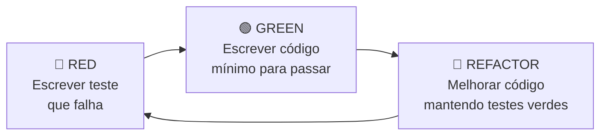

**Exemplo prático — Validação de CPF:**

```
1. 🔴 RED:    Escrever test: CPF.create("123.456.789-00") → válido
2. 🔴 RED:    Escrever test: CPF.create("000.000.000-00") → inválido
3. 🔴 RED:    Escrever test: CPF.create("abc") → inválido
4. 🟢 GREEN:  Implementar classe CPF com validação
5. 🔵 REFACTOR: Extrair algoritmo de dígito verificador
```

### 7.2 Estratégia de Testes

| Nível | Ferramenta | O que testa | Cobertura alvo |
|-------|------------|-------------|----------------|
| **Unitário** | Vitest | Entities, Value Objects, Use Cases | 90%+ |
| **Integração** | Vitest + Supabase local | Repositories, API Routes | 80%+ |
| **E2E** | Playwright | Fluxos completos (cadastro → matrícula → nota) | Fluxos críticos |

### 7.3 Ferramentas de Qualidade

| Ferramenta | Propósito |
|------------|-----------|
| **ESLint** | Linting (regras de código) |
| **Prettier** | Formatação consistente |
| **Husky + lint-staged** | Pre-commit hooks (lint + format + test) |
| **Vitest** | Unit e integration tests |
| **Playwright** | E2E tests |
| **TypeScript strict mode** | Type safety em compilação |
| **Zod** | Validação de dados em runtime |
| **Drizzle Kit** | Gerenciamento de migrations |

---

## 8. Tela de Listagem de Cadastros (Especificação de UI)

Baseada no layout do Sponte, porém modernizada:

### 8.1 Layout Principal

```
┌─────────────────────────────────────────────────────────────────┐
│ 🏫 CSM Gestão                                                   │
│ ┌──────┬──────────┬──────────┬──────────┬──────────┬────────┐   │
│ │Cadastros│Pedagógico│Financeiro│Biblioteca│Relatórios│Ferramentas│
│ └──────┴──────────┴──────────┴──────────┴──────────┴────────┘   │
│                                           🔔  👤 Admin ▼        │
├─────────────────────────────────────────────────────────────────┤
│                                                                  │
│  ┌─────────────────────┐  ┌────────────────────────────────────┐│
│  │ BARRA LATERAL       │  │ ÁREA PRINCIPAL                     ││
│  │                     │  │                                    ││
│  │ Ações               │  │ Alunos          [+ Novo Aluno]     ││
│  │ [📋][📥][📤][🖨️]   │  │                                    ││
│  │                     │  │ Filtros Avançados ▼                 ││
│  │ Acesso Rápido       │  │                                    ││
│  │                     │  │ ┌────┬──────┬─────┬───┬───┬───┬───┐││
│  │ Filtros Rápidos     │  │ │Clas│ Nome │N.Mat│CPF│Gên│Sit│Tel│││
│  │ ┌─────────────────┐ │  │ ├────┼──────┼─────┼───┼───┼───┼───┤││
│  │ │Nome/Matrícula   │ │  │ │ 👤 │João  │001  │...|M  │🟢 │...│││
│  │ └─────────────────┘ │  │ │ 👤 │Maria │002  │...|F  │🟢 │...│││
│  │ Situação:           │  │ │ 👤 │Pedro │003  │...|M  │🔴 │...│││
│  │ [Ativo ▼]           │  │ └────┴──────┴─────┴───┴───┴───┴───┘││
│  │ Cód.Barras:         │  │                                    ││
│  │ [___________]       │  │ Mostrando 1-20 de 847  [< 1 2 3 >]││
│  │                     │  │                                    ││
│  └─────────────────────┘  └────────────────────────────────────┘│
└─────────────────────────────────────────────────────────────────┘
```

### 8.2 Tela de Detalhe (Cadastro Individual — Abas)

```
┌──────────────────────────────────────────────────────────────┐
│ ← Voltar     João da Silva (Aluno)         [Salvar] [Ações ▼]│
├──────────────────────────────────────────────────────────────┤
│                                                               │
│  Turma Atual: 3º Ano A - Matutino    Situação: 🟢 Ativo     │
│  Nº Matrícula: 2026001  |  RA: SP123456  |  Cód.Barras: ... │
│                                                               │
│ ┌─────────────────────────────────────────────────────────┐   │
│ │Dados Pessoais│Endereço│Documentos│Responsáveis│Bancário│   │
│ │             │        │          │            │Anexos│Obs│   │
│ └─────────────────────────────────────────────────────────┘   │
│                                                               │
│  ┌─ Dados Pessoais ─────────────────────────────────────┐    │
│  │ Nome: [João da Silva Santos        ]                  │    │
│  │ Gênero: [Masculino ▼]  Data Nasc: [15/03/2018]      │    │
│  │ Idade: 8 anos         Estado Civil: [Solteiro ▼]    │    │
│  │ Cidade Natal: [São Paulo]  Nacionalidade: [Brasileira]│   │
│  │ ☐ Estrangeiro(a)                                     │    │
│  │ Profissão: [___]  Empresa: [___]                     │    │
│  │ Classificação: [Aluno ▼]                             │    │
│  │ ☑ Permitir empréstimo/reserva da biblioteca          │    │
│  │ Nº cartão catraca: [___________]                     │    │
│  │ ☐ Desativar Cadastro                                 │    │
│  └───────────────────────────────────────────────────────┘    │
└──────────────────────────────────────────────────────────────┘
```

---

## 9. Roadmap de Fases

### Fase 1 — MVP (Estimativa: 8-12 semanas)

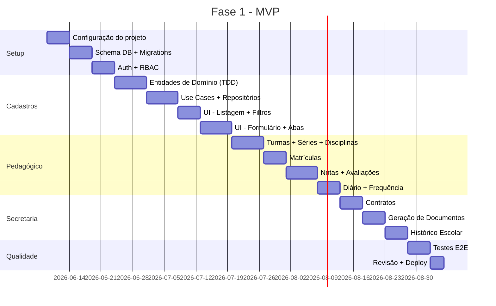

### Fases Futuras (Visão Geral)

| Fase | Módulos | Estimativa |
|------|---------|------------|
| **Fase 2** | Financeiro (Contas, Cobranças, Gateway de Pagamento) | 6-8 semanas |
| **Fase 3** | Biblioteca + RH + Catraca | 6-8 semanas |
| **Fase 4** | Portal do Responsável + Absorção CRM | 8-12 semanas |

---

## 10. Critérios de Aceite (Definition of Done)

Para cada funcionalidade ser considerada "pronta":

- [ ] Testes unitários escritos **antes** da implementação (TDD)
- [ ] Cobertura de testes ≥ 90% para entidades e use cases
- [ ] Validação com Zod para todos os inputs
- [ ] RLS configurado e testado para cada tabela
- [ ] Responsividade verificada (desktop + tablet)
- [ ] Acessibilidade básica (labels, ARIA, teclado)
- [ ] Code review aprovado
- [ ] Migration versionada e reversível
- [ ] Documentação de API (quando aplicável)

